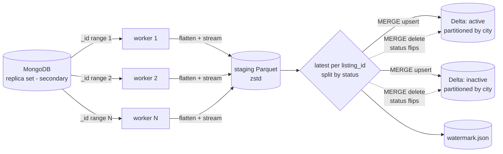

# MongoDB → Delta Lake Loader

A lightweight, **JVM-free** loader that turns a large, nested MongoDB collection into flat, typed **Delta Lake** tables. It uses Python, PyArrow and delta-rs. It supports parallel full loads, incremental upserts, and documents that move between *active* and *inactive*.

> A self-contained demo on dummy business-listing data, showing the patterns I use for large MongoDB-to-lake loads. No proprietary code or data is included.

## Architecture



## Key ideas

| Problem | Solution |
|---|---|
| A single `mongoexport` cursor is slow and single-core | The collection is split into **N `_id` ranges** (ObjectIds are time-ordered), each read by its own process with its own connection |
| Multiprocessing loses time pickling big result sets back to the parent | Workers **stream straight to Parquet files**; only file paths go back |
| Nested, inconsistent documents (optional fields, arrays, bad values) | A **declarative column mapping** (`schema.py`): one line per column, safe path lookup (`contact.phones.0`), cleaning functions; bad values become NULL instead of failing the batch |
| Documents change status | Routed to separate **active / inactive** tables; a flip is an upsert into the new table and a `MERGE … DELETE` from the old one, in both directions |
| Re-runs and overlaps must not duplicate data | Dedup per `listing_id` (latest `updated_on`) + `MERGE` that only overwrites with **newer** versions, so re-running a window changes nothing |
| Time zones | Timestamps are kept as **UTC with an explicit zone** in Arrow/Delta, not silently stripped |
| Small files from frequent runs | `--mode compact` runs Delta `OPTIMIZE` + `VACUUM` |

## Project structure

```
mongo_delta/
  schema.py     column mapping, path resolver, flatten()
  extract.py    _id range splitting, parallel streaming extraction
  load.py       Delta MERGE upsert / delete, dedupe, compaction (delta-rs)
  pipeline.py   entry point: full | incremental | compact
scripts/generate_data.py   dummy documents: seed + churn (updates, status flips, inserts)
config/pipeline.json
tests/test_loader.py       end-to-end tests with mongomock
```

## Run it

```bash
docker compose up -d
pip install -r requirements.txt
python scripts/generate_data.py --mode seed --rows 200000

# point the config paths at a local folder for a quick try
python mongo_delta/pipeline.py --config config/pipeline.json --mode full
python scripts/generate_data.py --mode churn --updates 5000 --flips 500 --inserts 1000
python mongo_delta/pipeline.py --config config/pipeline.json --mode incremental
python mongo_delta/pipeline.py --config config/pipeline.json --mode compact
```

Each run logs a summary (example):

```
Done: {'mode': 'incremental', 'extracted': 6500,
       'active': {'inserted': 812, 'updated': 5210}, 'inactive': {...},
       'moved_to_inactive': 251, 'moved_to_active': 249, 'seconds': ...}
```

Query the result with anything that reads Delta (Spark, Trino, DuckDB, pandas):

```python
from deltalake import DeltaTable
df = DeltaTable("/data/lake/businesses_active").to_pandas(filters=[("city", "=", "pune")])
```

## Tests

```bash
python -m pytest -q tests
```

Covered: nested path resolution, cleaning and bad-value handling, full load, incremental update, new document, an active → inactive flip removed from the old table, and idempotent re-runs.

## Production notes

- Read from a **secondary** (`readPreference=secondaryPreferred`) so the primary is not loaded.
- Keep an index on `updated_on`; incremental pulls depend on it.
- For HDFS on Hadoop 2.x, where delta-rs cannot write directly, build the table locally and `hdfs dfs -put` it, or switch the writer to Spark + Delta. The mapping and extraction code stay the same.
- Next step: MongoDB change streams → Kafka → consumer, for near real-time updates.

---
**Author:** Mahendra H Seth, Senior Data Engineer (Hadoop · PySpark · Hudi · Delta Lake · MongoDB · MySQL)
